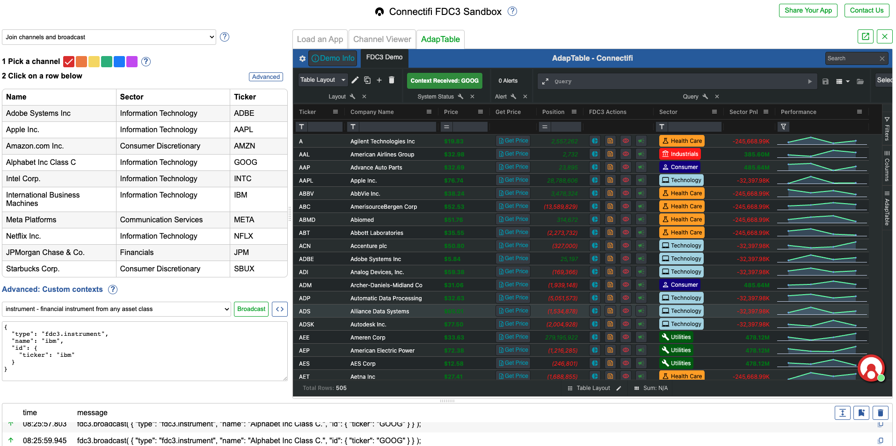
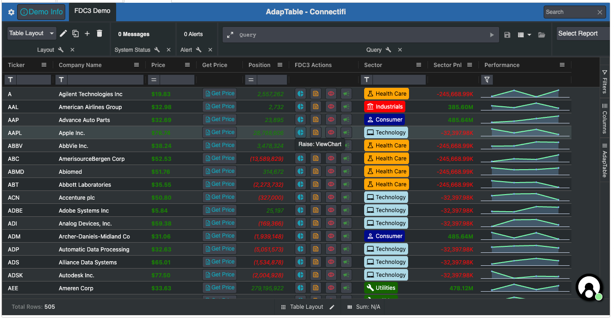
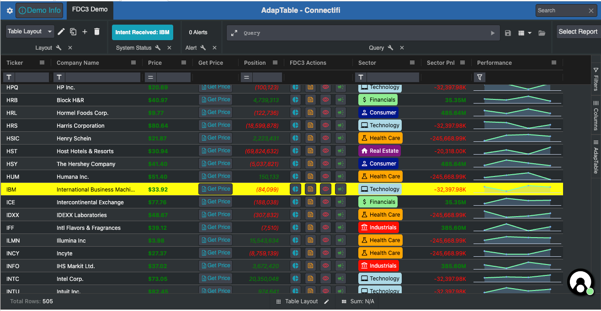
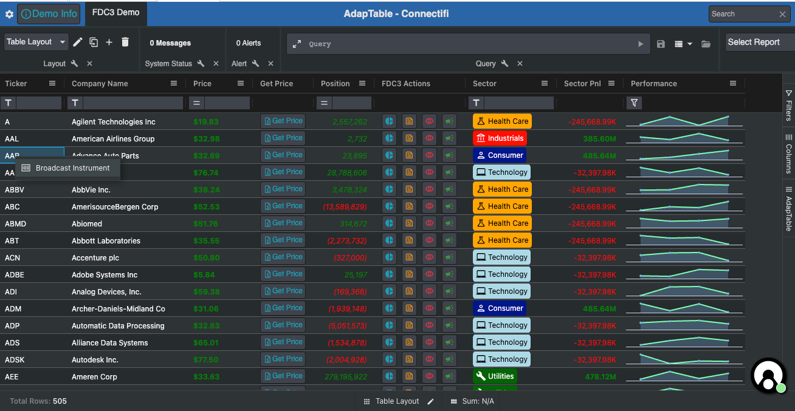
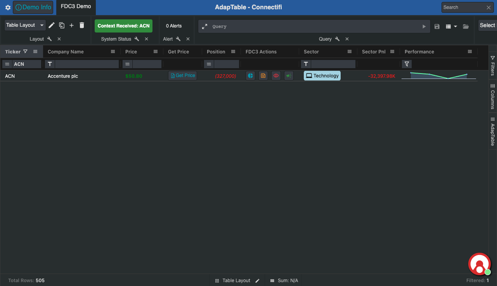

# AdapTable & Connectifi FDC3 2.0 Demo

This demo app illustrates some AdapTable FDC3 2.0 features using [Connectifi](https://www.connectifi.co/) as the desktop agent.

AdapTable provides comprehensive [FDC3 functionality](https://docs.adaptabletools.com/guide/handbook-fdc3) including ability to raise and listen for Intents and broadcast and listen for Context.

> The app requires AdapTable Version 16.0.3 and higher (and AG Grid 30.0 and higher)

See [this YouTube Video](https://youtu.be/aWO1dfhUEQc) for more information

## The Demo App

The app leverages the [Connectifi Sandbox](https://apps.connectifi-interop.com/sandbox) to show how the FDC3 capabilities in AdapTable can interop with other applications and widgets.

> The data in the app is purely meaningless **dummy data** for illustration purposes; only the Tickers are real

The app primarily uses the [FDC3 Instrument Context](https://fdc3.finos.org/docs/context/ref/Instrument) to manage Intents and Context, but all FDC3 context types are available out of the box in AdapTable.

In the app users are able to:

- Raise FDC3 Intents
- Listen for FDC3 Intents
- Broadcast FDC3 Context
- Listen for FDC3 Intetns
- Raise a Custom FDC3 Intent
- Define FDC3 Action Buttons, Action Columns and Context Menu Items

## AdapTable FDC3 

Using FDC3 in AdapTable is a 2-step process:

1. **FDC3 Mappings** are defined - essentially creating context using DataGrid fields and columns
2. **Intents** are Raised (and listened for) and **Contexts** are Broadcast (and listened for) using the Mappings created in Stage 1

> AdapTable provides FDC3 UI Components (Action Columns and Context Menus) to make this behaviour easily configurable

### FDC3 Mappings

Grid Data Mappings provide the “glue” to map AG Grid’s data and columns to required FDC3 behaviour.

> AdapTable looks at the mappings to work out which columns to use when creating Intents and Contexts.

This app has a single Mapping (to the [FDC3 Instrument Context](https://fdc3.finos.org/docs/context/ref/Instrument)) but there is no limit to how many mappings are allowed:

``` 
fdc3Options: {
  // Create a single Data Mapping - to FDC3 Instrument Context
  // Use `Name` column (defined by '_colId') as the Instrument Name
  // Use the `Symbol` field (defined by '_field') to map to Ticker (in `id` prop)
  gridDataContextMapping: {
    'fdc3.instrument': {
      name: '_colId.Name',
      id: {
        ticker: '_field.Symbol',
      },
    },
  },
}
```

### FDC3 Intents

AdapTable allows users to both **raise** and **listen for** FDC3 Intents.

> Both are configured using the ```intents``` property in FDC3 Options.

#### Raising Intents

Intents are raised using the `raises` property (in the `intents` section)

It contains a list of the Intents being raised with the key being the name of the Intent (e.g. ```ViewInstrument```).

Each Intent raised contains a contextType property which refers to an FDC3 Grid Data Mapping (see above).

It also contains behaviour using the FDC3 UI Components; this is typically either:

- an FDC3 Action Column Button definition (which is then displayed in the default FDC3 Action Column)
- a full, bespoke, FDC3 Action Column

> AdapTable provides the `defaultFDC3` property to show default Icons (and tooltips) in the buttons

In this demo we raise 3 FDC3 Intents and provide an Action Button definition for each:

> We also raise a Custom Intent which is discussed below

- `ViewChart`
- `ViewNews`
- `ViewInstrument`

```
raises: {
  // Raise 3 Intents: `ViewChart`, `ViewNews` and `ViewInstument`
  // Create an FDC3 Action Button for all 3 Intents
  // Each button will be rendered in the default FDC3 Action Column
  // Note: All 3 Intents use the mapping that was created in `gridDataContextMapping`
  ViewChart: [
    {
      contextType: 'fdc3.instrument',
      actionButton: {
        id: 'viewChartBtn',
        tooltip: 'Raise: ViewChart',
        icon: '_defaultFdc3',
        buttonStyle: {
          tone: 'info',
          variant: 'outlined',
        },
      },
    },
  ],
  ViewNews: [
    {
      contextType: 'fdc3.instrument',
      actionButton: {
        id: 'viewNewsBtn',
        tooltip: 'Raise: ViewNews',
        icon: '_defaultFdc3',
        buttonStyle: {
          variant: 'outlined',
          tone: 'warning',
        },
      },
    },
  ],
  ViewInstrument: [
    {
      contextType: 'fdc3.instrument',
      actionButton: {
        id: 'viewInstrumentBtn',
        tooltip: 'Raise: ViewInstrument',
        icon: {
          name: 'visibility-on',
        },
        buttonStyle: {
          tone: 'error',
          variant: 'outlined',
        },
      },
    },
  ],
},
```



#### Listening for Intents

Intents are listened for using the `listensFor` property (in the `intents` section).

It is typically accompanied by an implementation of the `handleIntent` property which is used to perform the necesary accompanying behaviour.

In this demo we listen for the `ViewInstrument` Intent and we then:

- jump to the row which which contains the instrument and highlight it in yellow for 5 seconds
- send a System Status message displaying the Context received

```
// listen for the `ViewInstrument` Intent
listensFor: ['ViewInstrument'],

// handle the Intent
handleIntent: (handleFDC3Context: HandleFdc3Context) => {
  const adaptableApi: AdaptableApi = handleFDC3Context.adaptableApi;
  const ticker = handleFDC3Context.context.id?.ticker;

  // Create a Row Highlight object and then jump to the row and higlight it
  const rowHighlightInfo: RowHighlightInfo = {
    primaryKeyValue: ticker,
    timeout: 5000,
    highlightStyle: {
      BackColor: 'Yellow',
      ForeColor: 'Black',
    },
  };
  adaptableApi.gridApi.jumpToRow(ticker);
  adaptableApi.gridApi.highlightRow(rowHighlightInfo);

  // Display an `Info` System Status Message with details of the Intent received
  adaptableApi.systemStatusApi.setInfoSystemStatus(
    'Intent Received: ' + ticker,
    JSON.stringify(handleFDC3Context.context),
  );
},
```



### FDC3 Context

AdapTable allows users to Broadcast (and listen for FDC3 Context).

> Both are configured using the ```contexts``` property in FDC3 Options.

#### Broadcasting Context

FDC3 Context is broadcast using the `broadcasts` property.

This contains a list of contexts to broadcast together with details of how to broadcast.

> The key is the Context mapping created in FDC3 Grid Data Mappings

There are 3 main ways to broadcast content - each of which uses an AdapTable FDC3 UI Component:

- an FDC3 Action Column Button definition (which is then displayed in the default FDC3 Action Column)
- a full, bespoke, FDC3 Action Column
- a Context Menu Item

In this app we Broadcast FDC3 Instrument Context in 2 ways:

- a Context Menu Item in the Name and Ticker columns
- an FDC3 Action Button

```
// Broadcast FDC3 Instrument in 2 ways:
// using a Context Menu Item in Ticker and Name columns
// via a FDC3 Action Button (which will be rendered in the default FDC3 Action Column)
// Note: The Context uses the mapping that was created in `gridDataContextMapping`
broadcasts: {
  'fdc3.instrument': {
    contextMenu: {
      columnIds: ['Ticker', 'Name'],
      icon: '_defaultFdc3',
    },
    actionButton: {
      id: 'broadcastInstrumentBtn',
      icon: { name: 'broadcast' },
      tooltip: `Broadcast: Instrument`,
      buttonStyle: {
        tone: 'success',
        variant: 'outlined',
      },
    },
  },
},
```



#### Listening for Context

FDC3 Context is listened for using the `listensFor` property (in the `contexts` section).

It is typically accompanied by an implementation of the `handleContext` property which is used to perform the necesary accompanying behaviour.

In this demo we listen for the 'fdc3.instrument' Context and we then:

- filter the Grid using the Ticker received in the Context
- send a System Status message displaying the Context received


```
// listen for the 'fdc3.instrument' Context
listensFor: ['fdc3.instrument'],

// handle the Context received
handleContext: (handleFDC3Context: HandleFdc3Context) => {
  if (handleFDC3Context.context.type === 'fdc3.instrument') {
    const adaptableApi: AdaptableApi = handleFDC3Context.adaptableApi;
    const ticker = handleFDC3Context.context.id?.ticker;

    // Filter the Grid using the received Ticker
    adaptableApi.filterApi.setColumnFilterForColumn('Ticker', {
      PredicateId: 'Is',
      PredicateInputs: [handleFDC3Context.context.id?.ticker],
    });

    // Display a `Success` System Status Message with details of the Context received
    adaptableApi.systemStatusApi.setSuccessSystemStatus(
      'Context Received: ' + ticker,
      JSON.stringify(handleFDC3Context.context),
    );
  }
},
```




### Custom FDC3

AdapTable also supports Custom FDC3 - for raising and listening for Intents and broadcasting and listening for Contexts.

In this app we raise a Custom `GetPrice` intent

> this integrates with functionality provided by the Connectifi sandbox to illustrate using custom FDC3

When raising Custom Intents an implementation for the `handleIntentResolution` property is typically provided (as we do in this app).

```
custom: {
  // Raise the Custom `GetPrice` Intent - using a bespoke FDC3 Action Column
  // When we receive a Price, display it in the column (instead of the button)
  GetPrice: [
    {
      contextType: 'fdc3.instrument',
      // Provide a bespoke Action Column definition
      actionColumn: {
        columnId: 'fdc3GetPriceColumn',
        friendlyName: 'Get Price',
        button: {
          id: 'GetPriceButton',
          label: (button, context) => {
            const price = priceMap.get(context.rowData.Symbol);
            return !!price ? `$ ${price}` : 'Get Price';
          },
          icon: (button, context) => {
            const price = priceMap.get(context.rowData.Symbol);
            return !price
              ? {
                  name: 'quote',
                }
              : null;
          },
          tooltip: (button, context) => {
            return `Get Price Info for ${context.rowData.Symbol}`;
          },
          buttonStyle: (button, context) => {
            return priceMap.has(context.rowData.Symbol)
              ? {
                  tone: 'success',
                  variant: 'text',
                }
              : {
                  tone: 'info',
                  variant: 'outlined',
                };
          },
          disabled: (button, context) => {
            return priceMap.has(context.rowData.Symbol);
          },
        },
      },
      // Handle the intent resolution by showing the returned Price in the Column
      handleIntentResolution: async (
        handleResolutionContext: HandleFdc3IntentResolutionContext,
      ) => {
        const intentResult =
          await handleResolutionContext.intentResolution.getResult();
        if (!intentResult?.type) {
          return;
        }
        const adaptableApi: AdaptableApi =
          handleResolutionContext.adaptableApi;
        const contextData = intentResult as Fdc3CustomContext;
        const ticker = contextData.id?.ticker;
        const price = contextData.price;
        if (ticker) {
          priceMap.set(ticker, price);
        }
        adaptableApi.gridApi.refreshColumn('fdc3GetPriceColumn');
      },
    },
  ],
},
```

### FDC3 UI Components

As can be seen AdapTable provides 2 main FDC3 UI Components:

#### FDC3 Context Menu Items

These leverage the the [AdapTable Context Menu](https://docs.adaptabletools.com/guide/ui-menu-context-menu).

AdapTable automatically places these menu items in the Context Menu.

#### FDC3 Action Columns and Buttons

These leverage [AdapTable Action Columns](https://docs.adaptabletools.com/guide/handbook-action-column).

There are 2 ways to define FDC3 Action Buttons:

**1. Provide a Button definition**

When a Button definition is provided, AdapTable will render that button in the default FDC3 Action Column.

The default FDC3 Action column has default configuration properties which can be overriden using the `actionColumnDefaultConfiguration` property, as we do in this app to make the column narrower:

```
// Narrow width of Default Action Column
actionColumnDefaultConfiguration: {
  width: 150,
},
```

**2. Providing a bespoke Action Column Definition**

Instead of simply providing buttons, developers can define a full FDC3 Action Column.

This app does that for the Custom `GetPrice` Intent (see the code above)

Both the Default FDC3 Action Column and any bespoke FDC3 Action Columns must be listed in the `columns` property in the [Layout](https://docs.adaptabletools.com/guide/handbook-layouts), as we do in this demo:

```
Layout: {
  CurrentLayout: 'Table Layout',
  Layouts: [
    Name: 'Table Layout',
    Columns: [
      'Ticker',
      'Name',
      'Price',
      'fdc3GetPriceColumn', // Bespoke FDC3 Action Column
      'Position',
      'Sector',
      'SectorPnl',
      'Performance',
      'fdc3ActionColumn', // Default FDC3 Action Column
    ],
  },
 ],
},
```

### Other AdapTable Objects

The demo contains a few other AdapTable [Predefined Config objects](https://docs.adaptabletools.com/guide/reference-predefined-config) and [Adaptable Options properties](https://docs.adaptabletools.com/guide/reference-options-overview) to create a more pleasing and realistic visual effect.   These include:

- [Theme](https://docs.adaptabletools.com/guide/handbook-theming) - set app to Dark Theme
- [Settings Panel](https://docs.adaptabletools.com/guide/ui-settings-panel) - added a Demo Info panel which describes this app
- [Dashboard](https://docs.adaptabletools.com/guide/ui-dashboard) - set the app's Title, provided some buttons including custom Info one which opens Demo Info panel described above
- [Status Bar](https://docs.adaptabletools.com/guide/ui-status-bar) - added Layout and Cell Summary panels
- [Format Column](https://docs.adaptabletools.com/guide/handbook-column-formatting) - lots of formats provided, particularly on the number columns
- [Calculated Column](https://docs.adaptabletools.com/guide/handbook-calculated-column) - defined - `Sector Pnl` - which aggregates all the Postions, grouped by Sector
- [Layout](https://docs.adaptabletools.com/guide/handbook-layouts) - 2 created: standard `Table Layout` and a `Sector Layout` with Row Grouping & Aggregations
- [Badge Style](https://docs.adaptabletools.com/guide/handbook-styled-column-badge) - on the Sector column
- [Sparkline Style](https://docs.adaptabletools.com/guide/handbook-styled-column-sparkline) - on the Performance column   
- [Menu Options](https://docs.adaptabletools.com/guide/ui-menu-context-menu) - provided implementation for `showAdaptableContextMenu` so only one item appears in Ticker Column's context menu


## The Tech Bits

### License Keys

Provide the AdapTable and AG Grid licenses as environment variables (in `.env` file or in your CI/CD pipeline)
- VITE_ADAPTABLE_LICENSE_KEY
- VITE_AG_GRID_LICENSE_KEY

### Installing

> This project uses [node](http://nodejs.org) and a package manager ([npm](https://npmjs.com), [yarn](https://yarnpkg.com/) or [pnpm](https://pnpm.io/)).

```sh
$ cd path-to-your-project
$ npm install

# pnpm install
# yarn install
```
### Usage

To run:

```sh
$ npm run dev

# pnpm run dev
# yarn run dev
```

## More about AdapTable

AdapTable is a product provided by Adaptable Tools - visit our [Website](http://www.adaptabletools.com) for more information.

### Licences

An [AdapTable Licence](https://docs.adaptabletools.com/guide/licensing) provides access to all product features as well as quarterly updates and enhancements through the lifetime of the licence, comprehensive support, and access to all 3rd party libraries.

Licences can be purchased individually, for a team, for an organisation or for integration into software for onward sale.

We can make a Trial Licence available for a short period of time to allow you to try out AdapTable for yourself.

Please contact [`sales@adaptabletools.com`](mailto:sales@adaptabletools.com) for more information.

### Help

Developers can learn how to access AdapTable programmatically at [AdapTable Documentation](https://docs.adaptabletools.com).  

Here you can see a large number of AdapTable demos each showing a different feature, function or option in AdapTable.

### Demos

To see AdapTable in action visit our [Demo Site](https://www.adaptabletools.com/demos) which contains a few larger demos.

